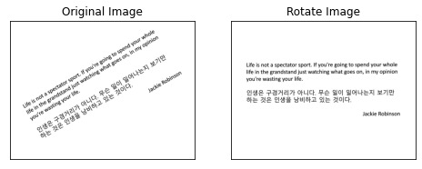

# Document image deskew
텍스트가 포함된 이미지에서 정확히 알 수 없는 각도로 회전된 이미지를 기울기 각도를 계산하여 기울어진 부분을 회전하기 위함



기울기 보정을 위해서 현재는 3가지의 방법으로 기능을 제공합니다.
```python
from deskew import available_tasks
available_tasks()
```

```python
"Available tasks are ['bbox', 'fft', 'ht']"
```

# usage

### get_angle_bbox:
1) 이미지에서 텍스트 블록을 감지
2) 회전된 텍스트의 각도를 계산
4) 해당 각도로 이미지 회전

```python
import cv2
from deskew import get_angle_bbox
from deskew import rotate

img_path = 'test_image/test_image1.jpg'
img = cv2.imread(img_path)

angle = get_angle_bbox(img)
print('Angle : {} degrees'.format(angle))

ratate_img = rotate(img, angle)
```

### get_angle_fft:
1) ```np.fft.fft2()```함수로 주파수 영역으로 변환을 이용한 기울기 계산
2) 스펙트럼은 푸리에 변환을 통해 얻은 각 주파수 성분이 원 신호(이미지)에 얼마나 강하게 포함되어 있는지 표현
3) cv2.getOptimalDFTSize()를 이용하여 최적의 크기를 찾아 각도를 추출
4) 해당 각도로 이미지 회전
```python
import cv2
from deskew import get_angle_fft
from deskew import rotate

img_path = 'test_image/test_image1.jpg'
img = cv2.imread(img_path)

angle = get_angle_fft(img)
print('Angle : {} degrees'.format(angle))

ratate_img = rotate(img, angle)
```

### get_angle_hough_transform:
1) 이미지를 Grayscale로 변환
2) Canny 필터
3) 0.1에서 180도 각도 사이의 허프 라인을 찾음
4) line peak에서 각도 반올림 (소수점 이하 2자리까지)
5) 가장 많이 발생하는 각도를 추출
6) 해당 각도로 이미지 회전

=> 가장 빠르고 정확
```python
import cv2
from deskew import get_angle_hough_transform
from deskew import rotate

img_path = 'test_image/test_image1.jpg'
img = cv2.imread(img_path)

angle = get_angle_hough_transform(img)
print('Angle : {} degrees'.format(angle))

ratate_img = rotate(img, angle)
```